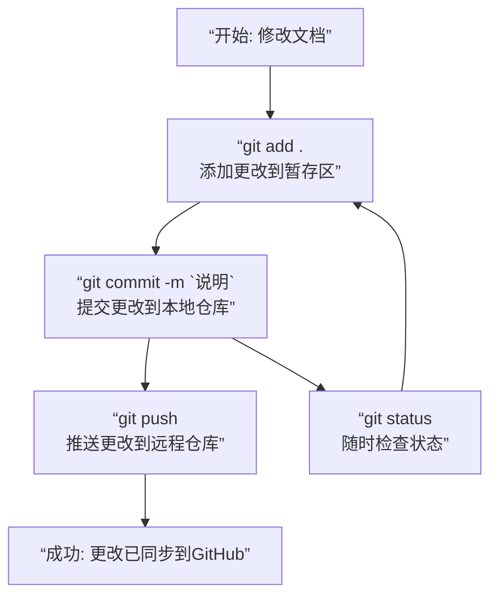

# Git 学习笔记

## 概述

Git 是一个分布式版本控制系统，用于跟踪文件的变化。对于技术文档工程师而言，Git 是：
- **文档的“存档”**：可以回溯到任意历史版本。
- **团队协作**：与开发团队使用同一种工具和工作流。
- **发布工具**：通过 GitHub Pages 直接发布在线文档。

## 核心概念

| 概念 | 解释 | 比喻 |
|:---|:---|:---|
| **仓库** | 项目所在的目录，Git 据此进行版本控制 | 整个项目的“档案馆” |
| **提交** | 一次版本的变化记录，包含改动的文件和说明 | 档案馆里的一个“存档快照” |
| **分支** | 独立开发的线路，不影响主线 | 档案馆里开辟的“临时工作区” |
| **远程** | 托管在互联网上的仓库（如 GitHub） | 档案馆的“云端备份” |

## 基础工作流程

这是技术文档工程师最常用的 Git 工作流程，它清晰地展示了从本地修改到云端同步的完整闭环：

